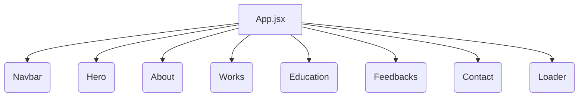
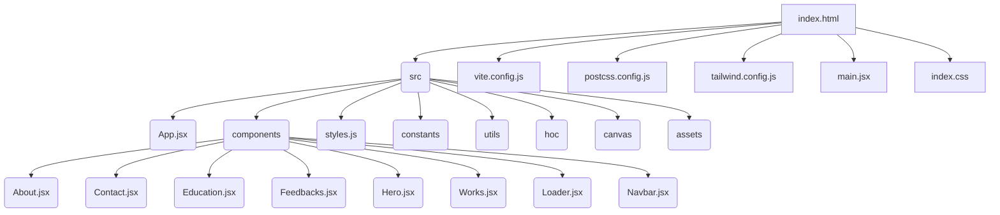

# ⚡ Portfolio

> A personal portfolio website showcasing projects and skills.

[](https://www.npmjs.com/package/portfolio)


## 📚 Table of Contents

- [Description](#description)
- [Tech Stack](#tech-stack)
- [Architecture Overview](#architecture-overview)
- [File Structure](#file-structure)
- [Features](#features)
- [Installation](#installation)
  - [Prerequisites](#prerequisites)
  - [Setup](#setup)
- [Usage](#usage)
  - [Execution Options](#execution-options)
- [Contributing](#contributing)
- [Contributors](#contributors)
- [License](#license)


## Description

This project is a frontend portfolio website built using React.js, showcasing my skills and projects through an interactive and visually appealing user interface.  The website utilizes React components for modularity and organization, with styling provided by Tailwind CSS.  The website's core functionality revolves around displaying my projects, skills, education, and contact information.  Key components include a hero section, about me, education, projects, and a contact form.


## Tech Stack

[](https://reactjs.org/)
[](https://tailwindcss.com/)
[](https://vitejs.dev/)
[](https://postcss.org/)
[](https://html.spec.whatwg.org/)
[](https://www.w3.org/Style/CSS/)
[](https://developer.mozilla.org/en-US/docs/Web/JavaScript)
[](https://github.com/PIYUSH1SAINI/ReadMe-wiz.git)


## Architecture Overview



## File Structure




## Features

-   **Responsive Design:**  Adapts seamlessly to various screen sizes.
-   **Smooth Animations:** Uses Framer Motion for engaging transitions.
-   **Interactive 3D Canvas:**  A visually appealing 3D element on the homepage.
-   **Modular Components:** Built with reusable React components for maintainability.
-   **Contact Form:** Allows visitors to easily get in touch.
-   **Project Showcase:**  Displays a portfolio of completed projects.

## Installation

### Prerequisites

> [!NOTE]
> Node.js >=14 and npm (or yarn) are required.

### Setup

1. **Clone Repository**: Clone the repository from GitHub and set up the project locally for development or modification.
   ```bash
   git clone https://github.com/raghavG0212/Portfolio.git
   cd Portfolio
   npm install
   ```

## Usage

### Execution Options

#### Frontend Execution

To start the development server, run:

```bash
npm run dev
```

This will open the application in your browser.  Any changes you make to the code will be reflected automatically.

To build the application for production, run:

```bash
npm run build
```

This will create an optimized build in the `dist` folder.


## Contributing

Contributions are welcome! Please open an issue or submit a pull request.


## Contributors

<a href="https://github.com/raghavG0212" target="_blank"></a>

## License

MIT License


<a href="https://github.com/PIYUSH1SAINI/ReadMe-wiz.git" target="_blank">
      
    </a>
